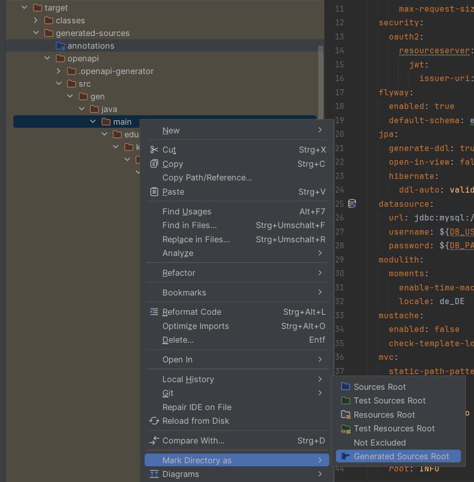

# Backend

Allgemeine Hinweise zum Ausführen der Anwendung befinden sich in der ReadMe im `code` Ordner.

## API Generierung

Ausführen von `mvn compile` generiert die API (alle Dateien aus `src/resources/api`) im `target/generated-sources/openapi` Ordner. Für IntelliJ-Benutzer: Es kann sein, dass der Ordner nicht von IntelliJ erkannt wird und deshalb die Anwendung nicht kompilieren kann. Der `main` Ordner in den generierten Dateien muss als `Generated Sources` markiert werden.

## Modulith

[Dokumentation](https://docs.spring.io/spring-modulith/docs/current-SNAPSHOT/reference/html/)

Durch den `DocumentationTest` kann die Struktur der Module geprüft werden (z.B. zyklische Abhängigkeiten). Außerdem wird eine Dokumentation der Anwendungsstruktur generiert. Diese befindet sich in `target/spring-modulith-docs`.

## Tests

Die Tests sind ausschließlich Integrationstests und starten deshalb die gesamte Anwendung. Es gibt keine komplizierte Logik, deshalb wurde auf Unit-Tests verzichtet bis jetzt. Die Integrationstests verwenden Testcontainers. Es wird daher Docker für die Ausführung benötigt.

## UserContext

Der `UserContext` beinhaltet Informationen über den aktuell authentifizierten Benutzer. Die Daten werden in einer `ThreadLocal` Variable gespeichert. Deshalb sind die Daten nur innerhalb des aktuellen Threads gültig. Sollten mehrere Threads für eine Anfrage gestartet werden, muss der `UserContext` für jeden Thread neu initialisiert werden.

Der `UserContext` wird in `edu.kit.elst.rest_api.security.JwtUserExtractorFilter` gesetzt. Es finden aktuell keine Plausibilitätschecks statt.
